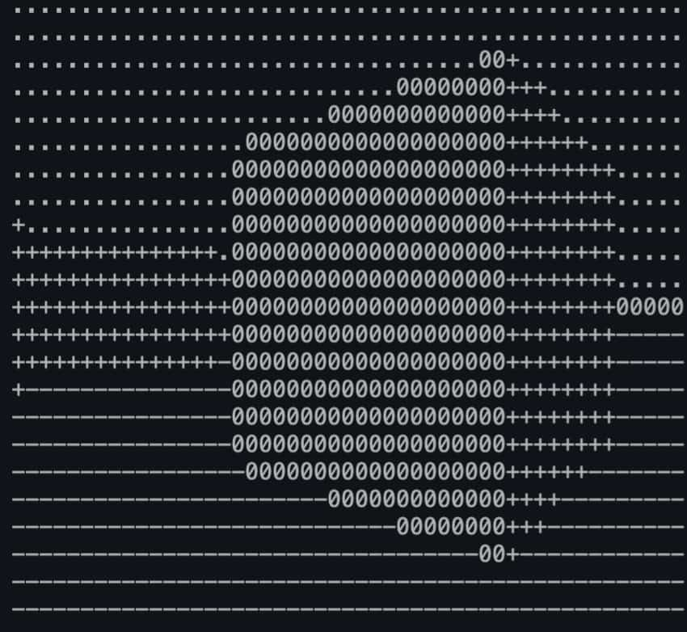

# Shell3D

Small implementation of a [Ray Casting](https://en.wikipedia.org/wiki/Ray_casting) renderer in ASCII.

Highly inspired of Lode Vandevenne [blog post](https://lodev.org/cgtutor/raycasting.html) on Ray Casting.

> Sample of a block being rendered

# How to run it

1. clone repo
2. run `make` at the root of the directory to build the project
3. run `./cub3D` at the root of the directory to run it
   - `./cub3D [map]` to run a custom map

# How to make a map

You can copy the example `./maps/city.cub` for inspiration.

- the `R 90 30` means resolution of `width=90 x height=30` (a.k.a. how many pixels (characters) to print)
- you can safely ingore all the setting after it
- the map is represented with characters at the end of the file (it has to be a rectagle)
  - `N`, `S`, `W` or `E` will be the initial position and the direction of the player
  - `1` means wall
  - `0` means empty block

This is a fork of my project for [42 School](https://42.fr).

Only tested on MacOS.
